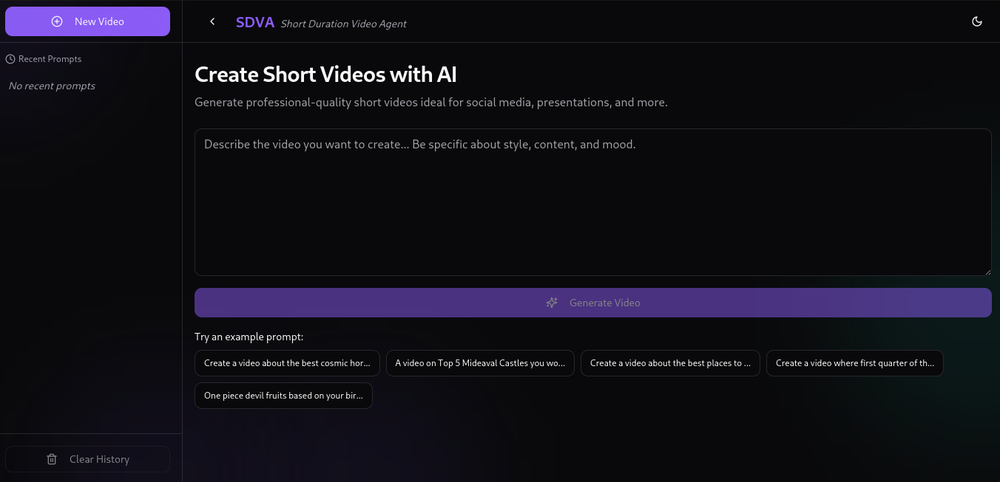

# Short Duration Video Agent (SDVA)



Short Duration Video Agent (SDVA) is a powerful tool for generating professional-quality short videos ideal for social media, presentations, and more. It leverages advanced AI models to create engaging video content based on user prompts.

## Features

- **Prompt-Based Video Generation**: Generate videos by providing simple text prompts.
- **Text-to-Speech (TTS)**: Convert dialogues into audio using TTS.
- **Image Generation**: Create images based on detailed prompts.
- **Subtitles Creation**: Automatically generate subtitles for video segments.
- **Background Music**: Add background music to videos with adjustable volume.
- **SSE for Live Logs**: Receive live logs about video generation via Server-Sent Events (SSE).

## Installation

1. **Clone the repository**:
    ```sh
    git clone https://github.com/yourusername/short-duration-video-agent.git
    cd short-duration-video-agent
    ```

2. **Install dependencies**:
    ```sh
    npm install
    ```

3. **Set up environment variables**:
    Create a `.env` file in the root directory and add the following:
    ```env
    API_KEY=your_together_ai_api_key
    ```

4. **Build the client**:
    ```sh
    cd public/client
    npm install
    npm run build
    ```

## Usage

1. **Start the server**:
    ```sh
    npm start
    ```

2. **Access the client**:
    Open your browser and navigate to `http://localhost:3000`.

3. **Generate a video**:
    - Enter a prompt in the input field and click "Generate Video".
    - Monitor the live logs to see the progress of video generation.
    - Once the video is generated, it will be available for download.

## API Endpoints

- **POST `/generate/video`** : Starts video generation.
    - **Request Body**:
        ```json
        {
          "prompt": "Your video prompt here"
        }
        ```
    - **Response**:
        ```json
        {
          "eventId": "unique_event_id",
          "message": "Video generation started."
        }
        ```

- **GET `/events/:eventId`** : SSE endpoint to receive live logs about video generation.
    - **Response**: Stream of log messages.


## Scripts

The following scripts are defined in the `package.json`:

- **Start the server**:
    ```sh
    npm start
    ```

- **Run the server with nodemon**:
    ```sh
    npm run server
    ```

- **Run the client in development mode**:
    ```sh
    npm run client
    ```

- **Run both server and client concurrently**:
    ```sh
    npm run dev
    ```

## Contributing

Contributions are welcome! Please open an issue or submit a pull request for any improvements or bug fixes.


## Acknowledgements

- [Together AI](https://together.ai) for providing the AI models and API.
- [ffmpeg](https://ffmpeg.org) for video processing capabilities.
